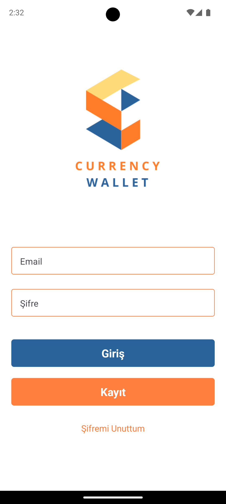
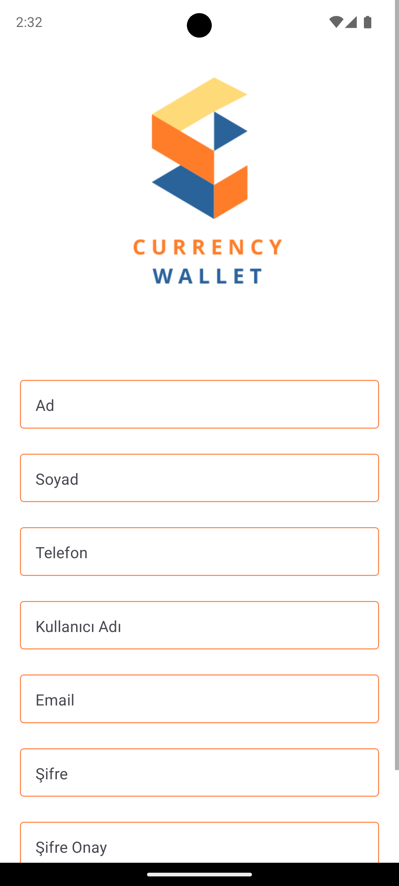
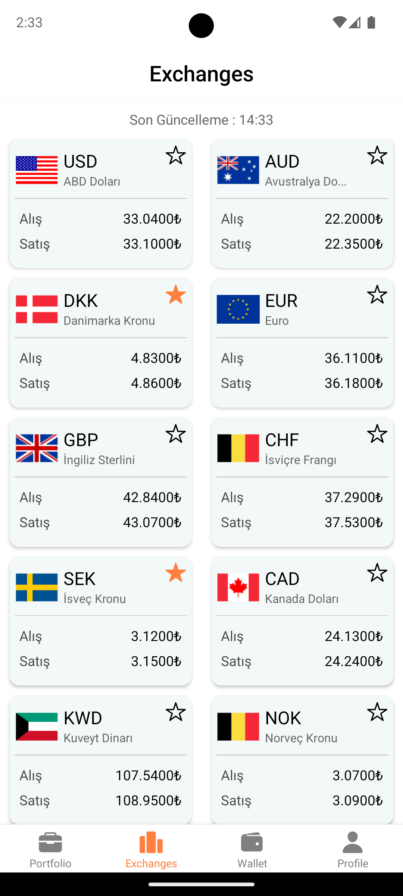
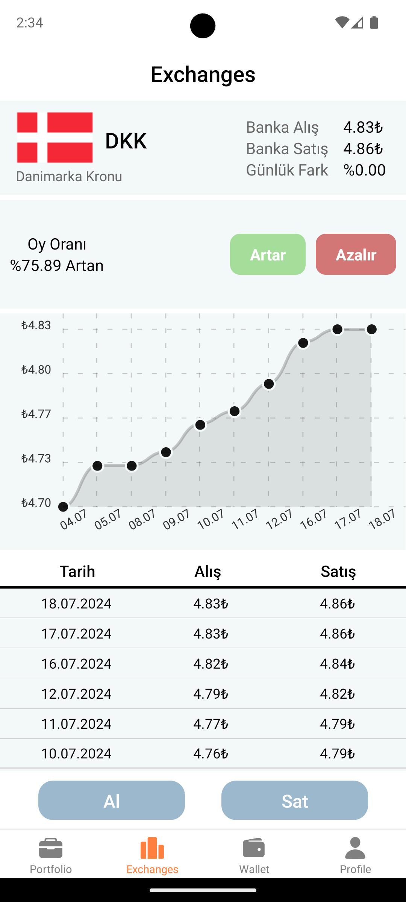
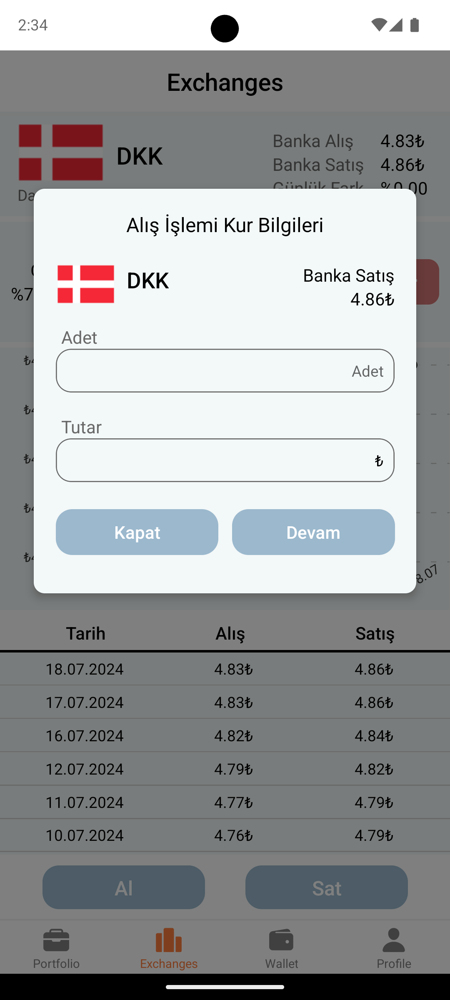
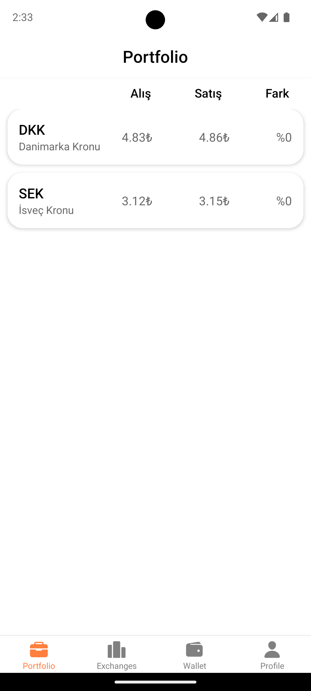
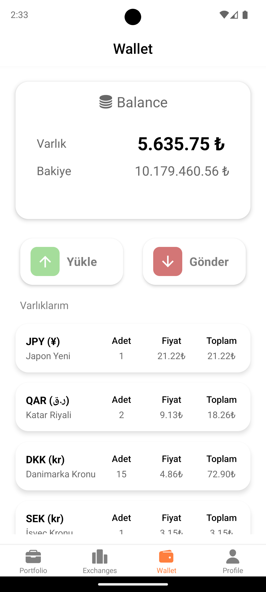
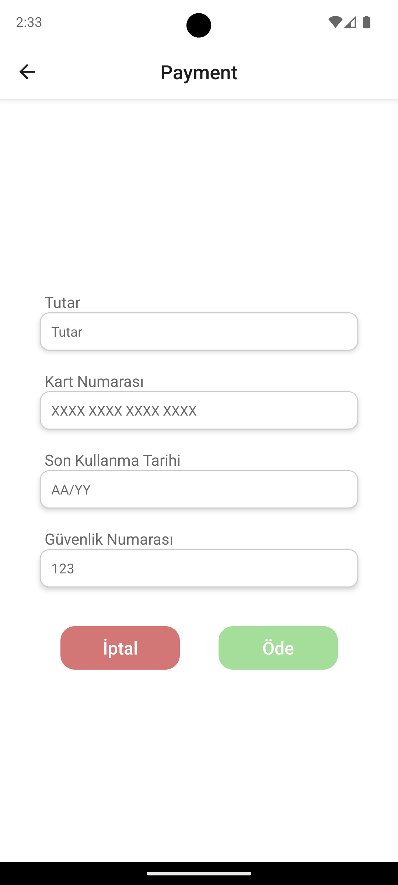
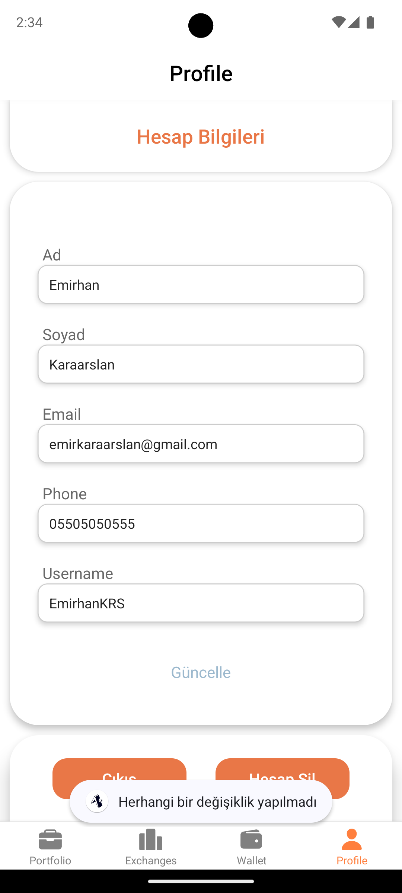

# 📱 CurrencyWallet

## 🎯 Purpose  
The purpose of this project is to enable users to create their own wallet accounts, track current exchange rates, and perform trading transactions. Additionally, a user-friendly and simple interface has been designed for ease of use. 

---

## 🛠️ Technologies Used  
- **Expo**  
- **REST API**   
- **JavaScript**
- **VS Code / Android Studio**

---

## 📸 Screenshots  
| Login | Register | Currency | 
|----------|----------|----------| 
|  |  |  |

| Detail | Exchange | Portfolio |
|----------|----------|----------|  
|  |  |  | 

| Wallet | Payment | Profile |  
|----------|----------|----------| 
|  |  |  |  

---

## 🚀 Installation and Running  
To run the project on your local machine, follow the steps below:

1. **Clone the project:**  
   ```bash
   git clone https://github.com/username/project-name.git
   cd project-name

2. **Install Dependencies:**  
   ```bash
   npm install
   #or
   yarn install
